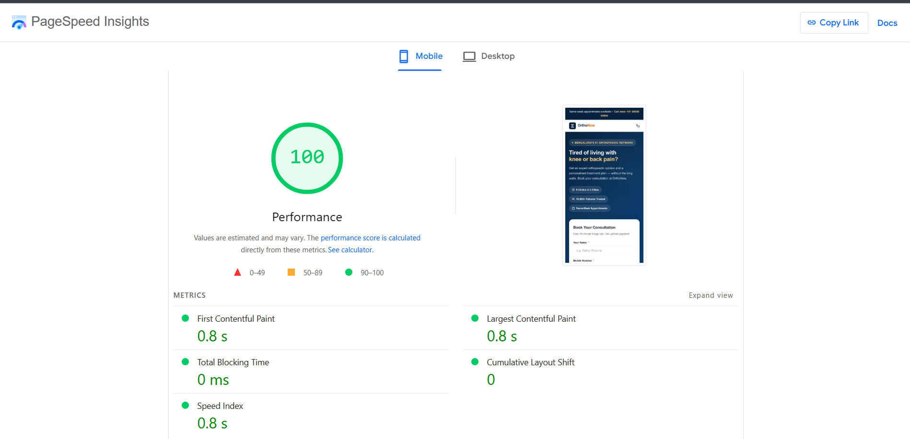

# OrthoNow — Namoza Developer Assignment Submission

**Role:** Developer - Position 1 (Client Web + Martech)
**Submitted by:** Mantasha Choudhary
**Email submission:** `naman@namoza.com` | Subject: `Developer Assignment - Mantasha Choudhary`

---

## 🌐 Live Landing Page

**👉 [View Live Page](https://anwarkhalid00.github.io/namoza-assignment/task2_landing_page.html)**

---

## 📊 PageSpeed Insights — Mobile Score



| Metric | Score |
|---|---|
| 🟢 Performance | **100 / 100** |
| 🟢 First Contentful Paint | 0.8s |
| 🟢 Largest Contentful Paint | 0.8s |
| 🟢 Total Blocking Time | 0ms |
| 🟢 Cumulative Layout Shift | 0 |
| 🟢 Speed Index | 0.8s |

> 🔗 [Run PageSpeed yourself →](https://pagespeed.web.dev/analysis?url=https://anwarkhalid00.github.io/namoza-assignment/task2_landing_page.html)

---

## 📁 Repository Structure

```
namoza-assignment/
├── README.md                     ← Submission overview (you are here)
├── task1_gtm_schema.md           ← Task 01: Full GTM event schema + dataLayer JSON
├── task2_landing_page.html       ← Task 02: Self-contained landing page
├── task3_integration_design.md  ← Task 03: HubSpot + WhatsApp integration writeup
└── pagespeed_mobile_score.png   ← PageSpeed Insights Mobile screenshot (100/100)
```

---

## Task 01 — GTM Event Schema

📄 [`task1_gtm_schema.md`](./task1_gtm_schema.md)

- Complete GTM event schema for all **6 key OrthoNow interactions** in a structured table
- **Actual `dataLayer.push()` JSON** for all 3 booking form steps (not pseudocode)
- GTM trigger configuration per step with filter conditions
- How to surface step-level funnel drop-off in **GA4 Funnel Exploration**
- Justified choice of **one Google Ads conversion action** and why over the others

---

## Task 02 — Landing Page Build

📄 [`task2_landing_page.html`](./task2_landing_page.html)
🌐 [Live Demo](https://anwarkhalid00.github.io/namoza-assignment/task2_landing_page.html)

Open directly in any browser — **no server required.**

### Built with
- ✅ Single self-contained HTML file — no frameworks, no build tools
- ✅ Vanilla HTML + CSS + JavaScript only
- ✅ 2-field form (Name + Phone) with Indian number validation (6–9 prefix, 10 digits)
- ✅ Trust elements: 3 specialist doctors, 9 clinic locations, 15K+ patients, 4.8★ reviews
- ✅ GTM `dataLayer.push()` fires on form submit — **not on page load**
- ✅ Thank-you state without page reload
- ✅ Mobile-first layout with sticky CTA bar
- ✅ **PageSpeed Mobile: 100 / 100**

### GTM dataLayer push (fires on submit)
```javascript
window.dataLayer.push({
  event:             'consultation_form_submitted',
  form_name:         'orthonow_consultation_lp',
  clinic_preference: 'Koramangala',
  page_location:     window.location.href,
  timestamp:         '2026-07-02T00:00:00.000Z'
})
```

### To verify live in browser
1. Open `task2_landing_page.html` in Chrome
2. Press `F12` → open Console tab
3. Fill Name + Phone → click submit
4. Look for: `[OrthoNow GTM] dataLayer push fired: {...}`

---

## Task 03 — Integration Design

📄 [`task3_integration_design.md`](./task3_integration_design.md)

~380-word written answer covering:
- **End-to-end architecture:** Landing Page → Serverless Function → HubSpot Contacts Search API → Karix WhatsApp API → Google Ads (client-side via GTM)
- **Why direct API** over Zapier / Make / HubSpot native embed
- **Phone deduplication** — HubSpot deduplicates on email by default; this form has no email field. Search-first approach solves this
- **Single biggest failure point** + SQS retry queue + SMS fallback
- **WhatsApp 2-minute SLA** monitoring via CloudWatch alarm + Karix delivery webhook

---

## Key Design Decisions

| Decision | Choice | Reason |
|---|---|---|
| Framework | None — Vanilla HTML/CSS/JS | Assignment requirement + best PageSpeed |
| Fonts | System font stack | Zero web font requests = faster LCP |
| Images | Inline SVG only | No image HTTP requests |
| HubSpot method | Direct Contacts API via serverless function | Phone dedup requires Search API first |
| WhatsApp fallback | SQS queue + SMS | Handles Karix downtime without SLA breach |
| PII in dataLayer | Phone excluded | Compliance — only metadata to GTM |
